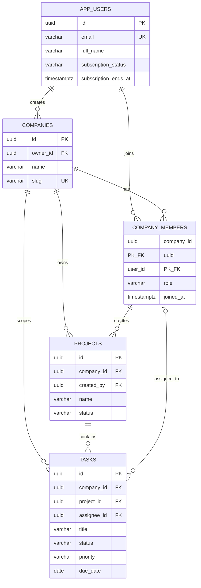

# SaaS database ERD



## Application flow

1. User registers or logs in.
2. The application records `subscription_status` and `subscription_ends_at` on
   `app_users`.
3. Only a user whose status is `active` and whose subscription has not ended may
   create a company. The database trigger enforces this rule.
4. The database automatically adds that user to `company_members` with the
   `owner` role.
5. Projects and tasks are scoped with `company_id`. Composite foreign keys stop
   a task, creator, or assignee from referencing another company's records.

## Tenant isolation

For every tenant-scoped transaction, the API must first set the company chosen
by the authenticated member:

```sql
SET LOCAL app.company_id = 'the-active-company-uuid';
```

The API must verify that the current user belongs to that company before setting
this value. PostgreSQL Row Level Security then prevents reading or changing rows
from another company.
